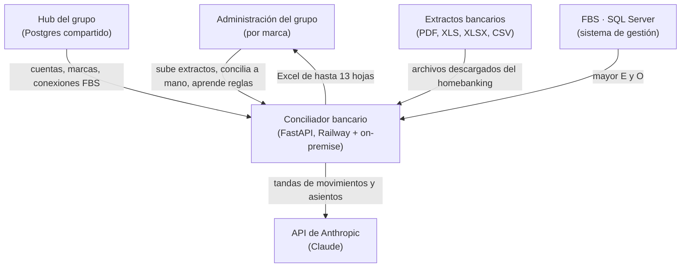
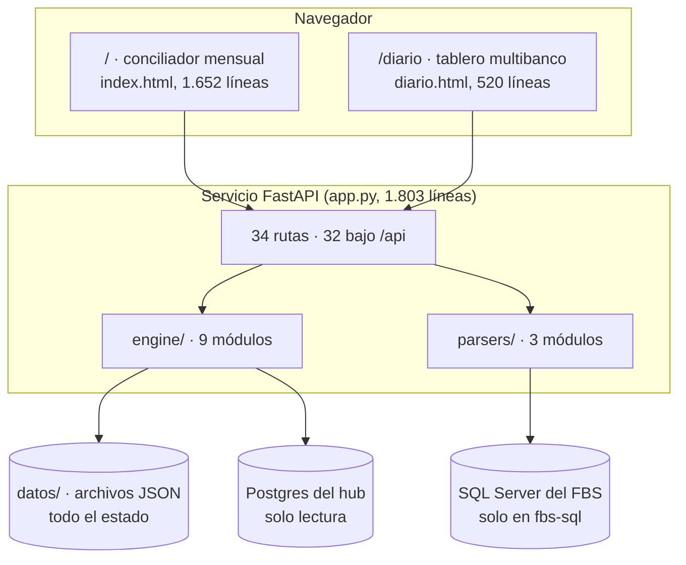

# Arquitectura del conciliador bancario

Fecha: 2026-09-16 · Estado del código: commit `8b3c5c1` de 2026-09-16 en `master` y `7b40005` de 2026-09-16 en `origin/fbs-sql`

Lo primero: el servicio de producción no tiene ninguna autenticación. La variable `CLAVE_ACCESO` que protegía `/api/*` vivió un día y se quitó el 2026-07-29 con el motivo escrito en el mensaje del commit, "pedido: acceso libre para testing" [`6803948`]. Quien tenga la URL ve los movimientos bancarios de todas las marcas del grupo, borra corridas con `DELETE /api/diario/{grupo_id}` y se lleva el estado entero con `GET /api/migracion/exportar` [`app.py:449-488,1185-1222`]. Todo lo demás de este documento se lee con eso en mente.

Este repo no expone una API para terceros, así que no hay `docs/api.md`: las 32 rutas bajo `/api` son el backend de sus propias dos páginas y cambian con ellas [`grep -c '^@app' app.py`].

## 1. Objetivo y atributos de calidad

El sistema cruza extractos bancarios contra el libro mayor del FBS y explica lo que no cruza. Tres atributos mandan, en este orden.

**Exactitud del cruce.** Un falso positivo es peor que un pendiente: si el motor consume un asiento ajeno del mismo importe, ese asiento queda marcado para siempre por la memoria y nadie lo va a encontrar. Ese bug existió y se corrigió endureciendo la confirmación entre corridas a referencia, importe y lado exactos [`f6a9a8c`; `app.py:851-920`]. La consecuencia de diseño es que el motor prefiere dejar algo sin conciliar antes que cruzarlo con dudas.

**Tolerancia a formatos nuevos.** Cada banco exporta distinto y el mismo banco cambia su export sin avisar. El repo ya absorbió el formato `descargaUltimosMovimientos` de Santander como un caso más [`80a1bb8`] y los parsers reconocen cinco bancos más un camino genérico por nombre de columna [`parsers/diarios.py:26,252-320`].

**Costo previsible de la IA.** Las sugerencias con Claude son opcionales y están topeadas: modelo más barato para el análisis por asiento, caché persistente, presupuesto diario y, cuando cualquiera de esas barreras se activa, un análisis determinístico interno [`engine/analisis.py:25-27,189-269`]. Sin credencial el sistema concilia igual [`app.py:281-283`].

Lo que deliberadamente no está entre los atributos: concurrencia y disponibilidad. El procesamiento corre en un hilo daemon sin límite de tandas y el estado vive en memoria del proceso, así que un segundo worker rompería el flujo [`app.py:43-45,196-200,941-943`].

## 2. Restricciones

El FBS es de solo lectura y no tiene API. En `master` eso significa que alguien exporta "Consulta del Mayor" a Excel y lo sube; en `fbs-sql` significa una query directa al SQL Server con tres capas de protección para que nunca pueda escribir [`1e4a143`].

El cliente opera en Windows. De ahí los `.bat` de arranque, el bind a la red local y el driver ODBC nativo con FreeTDS de respaldo [`iniciar.bat:1-8`; `83d1efd`; `fec38d7`].

No hay base de datos propia. Toda la persistencia son archivos JSON en `datos/`: trece de nombre fijo, más uno por corrida y uno por tablero diario. Viene del primer commit y nunca se revisó [ADR-0007].

El equipo es de una persona por repo. Axel Wdoviak firma 76 de los 78 commits [`git shortlog -sne --all`].

## 3. Contexto

| Actor o sistema | Qué intercambia | Protocolo o formato |
|---|---|---|
| Administración del grupo | Sube extractos y el mayor, concilia a mano, veta cruces, carga equivalencias | HTTP, formularios multipart, JSON |
| Hub del grupo | Catálogo de marcas, cuentas bancarias y conexiones FBS | Postgres por `DATABASE_URL`, solo `SELECT` [`engine/cuentas.py:111-114`] |
| Bancos | Extractos de Santander, BBVA, Galicia, Macro y Ciudad | PDF, XLS binario, XLSX, CSV [`parsers/diarios.py:26`] |
| FBS | Libro mayor de las cuentas E y O | Excel "Consulta del Mayor" en `master`; `SELECT` sobre `DetMov` en `fbs-sql` [`bbc35bc`] |
| API de Anthropic | Movimientos y asientos sin cruzar, en tandas | HTTPS, salida por `json_schema` [`engine/ai_assist.py:154-209`] |

El hub abre el conciliador con `?marca=` en la URL, y ese parámetro es todo el contrato de integración entre ambos: filtra `/api/cuentas`, `/api/diario` e `/identificar`, y etiqueta `/api/conciliar` [`app.py:509-518,1117-1123`; ADR-0003].

## 4. Estrategia de solución

**Tres pases determinísticos.** La IA queda afuera del resultado. El motor cruza por importe más referencia compartida, después por importe único, después por importe más fecha más cercana [`README.md:15-51`; `engine/matcher.py`]. Claude solo propone cruces difíciles que una persona confirma, y si la API falla el job ya tiene su resultado determinístico calculado [`app.py:279-287`]. Ver ADR-0004.

**FBS directo por SQL Server.** Leerlo en vez de subir el mayor a mano es el cambio de rumbo más grande del proyecto y vive en la rama `fbs-sql` desde el 2026-09-07 [`76f791e`; ADR-0001]. Sigue sin mergear.

**Catálogo de cuentas en el hub.** El Postgres del hub manda y la copia local respalda. Lo que el administrador cambia en el hub se refleja sin redeploy; si la base no responde, el servicio sigue con `datos/cuentas_nave.json` o la semilla [`engine/cuentas.py:4-14,94-129`; ADR-0002].

**Aprender del usuario.** Nada de pantallas de configuración. Reglas derivadas de la conciliación manual, equivalencias de vocabulario, excepciones de gastos y vetos de cruces automáticos se cargan desde la misma pantalla donde se trabaja y quedan guardados [`engine/reglas.py:61-80`; `f7a0954`]. El costo es que ese aprendizaje es global al servicio, no por marca [`engine/reglas.py:21`].

**Modo demo por variable.** La misma imagen con una variable más. Un segundo servicio de Railway apuntado a la misma rama, con `DEMO_MODE=true` [`README-DEMO.md:1-5`; ADR-0005].

## 5. Contenedores y bloques

**Páginas estáticas.** Dos HTML sin framework, con JavaScript escrito a mano contra `fetch` y tema claro u oscuro [`static/index.html:247`; `867d5da`]. Se sirven con `Cache-Control: no-cache` para que después de cada deploy el navegador traiga la interfaz nueva [`app.py:1789-1795`].

**Servicio FastAPI.** Un solo archivo concentra las rutas, la persistencia, el ciclo entre cuentas, el arrastre, los vetos y la generación del Excel [`app.py`]. Es el bloque más grande y el más frágil: 1.803 líneas y trece pares de funciones `_cargar_*`/`_guardar_*` que repiten el mismo patrón [`app.py:591-805`].

**Motor.** `matcher.py` tiene los tres pases, la separación de gastos bancarios y la nota de débito mensual, en 484 líneas. `analisis.py` explica asiento por asiento lo que quedó sin cruzar. `cuentas.py` resuelve el catálogo y el mapeo contra el FBS. `ai_assist.py` arma las tandas para Claude. `equivalencias.py`, `reglas.py` y `gastos_conf.py` guardan lo que el usuario enseña. `ia_log.py` audita tokens y dólares [`wc -l engine/*.py`].

**Parsers.** `diarios.py` identifica banco, cuenta y moneda de cada archivo y también lee los reportes del FBS. `santander_pdf.py` lee el PDF y define la dataclass del movimiento bancario. `mayor_xlsx.py` lee el Excel del mayor [`wc -l parsers/*.py`].

**Estado.** Trece archivos JSON de nombre fijo en `datos/`, más uno por corrida y uno por tablero diario. Esa carpeta tiene que estar montada como volumen para que el aprendizaje sobreviva a un redeploy [`README.md:85-86`].

## 6. Flujos de runtime

**Conciliación mensual.** `POST /api/conciliar` recibe los extractos, el Excel del mayor, el flag de IA y la marca; devuelve un `job_id` al instante y sigue trabajando en un hilo daemon mientras la interfaz consulta `GET /api/progreso/{job_id}` [`app.py:179-336`].

1. Los extractos entran por `santander_pdf.parse_extracto` o por `diarios.identificar`, según el formato.
2. El mayor entra por `mayor_xlsx.parse_mayor`, que exige las hojas E y O y corta listando las hojas si falta alguna.
3. `matcher.conciliar` netea la cuenta O, cruza contra la E en tres pases y clasifica el resto.
4. Si el usuario pidió IA, las tandas van a Claude; si falla, el job queda con `ia_estado` en error y el resultado determinístico intacto.
5. Se aplican los vetos guardados, se recalcula el resumen y `analisis.anotar_residuales` explica lo que sobró.
6. El resultado se escribe en `datos/<job_id>.json` y se puede bajar como Excel de hasta trece hojas desde `GET /api/exportar/{job_id}` [`app.py:1556-1718`].

Casos límite que el código contempla: un reporte del FBS cargado en el campo de extractos devuelve un error que explica dónde va; con `?marca=` puesta, un extracto de otra marca genera `avisos_marca`; si se cierra la pestaña el proceso sigue y al volver se ofrece retomar [`README.md:88-93`].

**Conciliación diaria multibanco.** `POST /api/diario/identificar` clasifica cada archivo subido como extracto o como reporte del FBS y deja lo parseado en `STAGING`, que vive en memoria. `POST /api/diario/conciliar/{staging_id}` agrupa por cuenta, aprende los mapeos FBS nuevos, aplica la memoria, procesa el ciclo entre la O y la E, arrastra lo pendiente y guarda un job por cuenta más un `grupo_<id>.json` [`app.py:520-591,937-1115`]. Si el proceso se reinicia entre los dos pasos, el staging se perdió y la segunda llamada devuelve 404.

**Ciclo O→E entre corridas.** Lo que ayer cruzó contra la cuenta O se arrastra al día siguiente. Si el mayor E de hoy trae ese asiento, el movimiento pasa a Conciliados (E) y se cancela la contrapartida en la O. La coincidencia exige la misma referencia o la misma clave `RM-xxxx`, el mismo importe y el mismo lado [`app.py:851-920`; `f6a9a8c`].

## 7. Deploy

Producción corre en Railway, construida desde el `Dockerfile`, que es el único archivo que define el deploy: no hay `railway.json`, `Procfile`, compose ni CI [`Dockerfile:1-11`; `find`]. La imagen es `python:3.12-slim` y el comando arranca uvicorn en `${PORT:-8765}`.

Hay además una instalación on-premise en Windows, en la máquina del cliente. Los `.bat` de la rama `fbs-sql` levantan el servicio en el puerto 8766 y `migrar_aprendizajes.py` copia equivalencias, gastos, reglas y mapeos desde Railway a esa máquina sin tocar las corridas locales [`b559d13`; `3e29338`]. La URL de producción está escrita a mano en ese script [`3e29338`].

Variables, solo nombres: `PORT`, `ANTHROPIC_API_KEY`, `ANTHROPIC_AUTH_TOKEN`, `DATABASE_URL`, `DEMO_MODE`, `ANALISIS_MAX_DIA`, y en `fbs-sql` las siete `FBS_SQL_*` [`app.py:51,343-344,1801`; `engine/cuentas.py:78`; `76f791e`]. El detalle de cada una está en `docs/operacion.md`.

## 8. Conceptos transversales

**Autenticación y permisos.** No hay. Ni login, ni sesión, ni token, ni registro de quién hizo cada cosa. Las notas de la conciliación manual y el log de uso de IA son lo único que queda escrito, y ninguno guarda autoría [`engine/ia_log.py:13,30-47`; `app.py:1299,1386`].

**Separación por marca.** `?marca=` filtra las cuentas y las corridas, y matchea por slug sin acentos y por contención, de modo que `gac-kyoto` alcanza para `Gac - Kyoto Driving Automoviles SA` [`engine/cuentas.py:176-189`]. Lo que no se separa por marca es el aprendizaje: reglas, equivalencias, gastos y vetos son globales al servicio [`engine/reglas.py:21`].

**Manejo de errores.** El parser de PDF marca `advertencia` en el movimiento cuando el monto impreso no coincide con el delta de saldos, y el débito o crédito se toma siempre del delta [`parsers/santander_pdf.py:5-6,170`]. Las fallas de Claude no cortan el job. Las fallas del Postgres imprimen el motivo y caen a la copia local, con caché de sesenta segundos para no martillar una base caída [`engine/cuentas.py:25,94-129`].

**Logs y diagnóstico.** Los logs son `print()` a stdout. `GET /api/diagnostico` hace de healthcheck: informa si la credencial de IA llegó al proceso, si `datos/` está montado como volumen, cuánto se gastó en IA ese día y los nombres de las variables parecidas, y nunca devuelve el valor de un secreto [`app.py:339-366`].

**Uso de IA.** Dos modelos: `claude-sonnet-5` para el matching en tandas de 80 movimientos contra 400 asientos, y `claude-haiku-4-5` para el análisis por asiento [`engine/ai_assist.py:14-15`; `engine/analisis.py:25`]. El análisis va en cascada: caché persistente, presupuesto diario, IA, análisis interno. El modo `?simular` genera sugerencias de prueba sin llamar a la API [`engine/ai_assist.py:116-151`].

**Formatos de archivo.** Extractos en PDF, XLS binario, XLSX y CSV. El mayor en XLS o XLSX con las dos hojas. La salida en XLSX: doce hojas fijas, más una de sugerencias cuando la IA propuso alguna [`app.py:1592,1633-1718`].

## 9. Riesgos y deuda técnica

1. **Sin autenticación, sobre movimientos bancarios reales de todas las marcas.** Está en `app.py` desde el 2026-07-29 y afecta a las rutas que borran, importan y exportan [`6803948`; `app.py:449-488,1186`]. Haría falta decidir el gate (clave propia o sesión del hub) y volver a ponerlo; el ticket `OR-21` discute lo mismo para el Panel Comercial [`[jira-OR.md]` OR-21].
2. **La rama `fbs-sql` lleva 31 commits sin mergear.** Es la lectura directa del FBS, corre on-premise con un `.bat` que el propio mensaje del commit declara TEMPORAL, y cinco arreglos tienen hash distinto en cada rama porque se aplicaron dos veces [`git log master..origin/fbs-sql`; `b559d13`]. Cada semana que pasa el merge cuesta más.
3. **Todo el estado son archivos dentro del contenedor.** Sin el volumen en `/app/datos`, un redeploy borra reglas, equivalencias, memoria, arrastre y todas las conciliaciones guardadas [`app.py:356-358`; `README.md:85-86`]. Si está montado o no se responde entrando a `/api/diagnostico`.
4. **Cero tests sobre lógica contable que ya tuvo bugs.** No hay `tests/`, ni pytest, ni CI [`find`; `requirements.txt`]. El ciclo O→E, la memoria y el arrastre se corrigieron por errores reportados desde el uso [`f6a9a8c`].
5. **Estado en memoria del proceso.** `RESULTADOS`, `PROGRESO` y `STAGING` se pierden con cada reinicio y no sobreviven a más de un worker [`app.py:43-45,941-943`].
6. **Dependencias sin lockear.** Las ocho líneas de `requirements.txt` usan `>=` y el `Dockerfile` reinstala en cada build [`requirements.txt`; `Dockerfile:4-5`].
7. **Treinta cuentas bancarias reales escritas en el código** como semilla, con el comentario "tabla pasada por el cliente" [`engine/cuentas.py:27-60`]. Desde el 2026-09-01 la fuente es el hub, así que la semilla quedó como respaldo histórico.
8. **`iniciar_8766.bat` mata con `taskkill /f` cualquier proceso que escuche en 8765** [`b559d13`].
9. **La credencial de IA puede vivir en `datos/anthropic_key.txt`**, fuera de cualquier gestor de secretos [`engine/ai_assist.py:26-33`]. No hay secretos commiteados.

## 10. Glosario

| Término | Definición | Nombre en el código |
|---|---|---|
| FBS | Sistema de gestión de las concesionarias, sobre SQL Server | `fbs`, tabla `DetMov` |
| Conexión FBS | Fila del hub con servidor, base y credencial de una instancia del FBS | `fbs_conexiones` |
| Marca | Concesionaria del grupo | `marcas`, parámetro `?marca=` |
| Cuenta E | Cuenta contable que debería reflejar el extracto | `hoja == "E"` |
| Cuenta O | Cuenta operativa con lo pendiente de confirmar | `hoja == "O"` |
| Mayor | Libro mayor exportado del FBS | `AsientoMayor` |
| Extracto | Resumen de cuenta del banco | `MovimientoBanco` |
| Arrastre | Pendientes de la corrida anterior que vuelven a la siguiente | `arrastre_diario.json` |
| Memoria | Registro de cuántas veces se consumió cada movimiento o asiento | `memoria_conciliados.json` |
| Veto | Cruce automático que el usuario anuló y no se vuelve a proponer | `cruces_vetados.json` |
| Equivalencia | Par de términos que el banco y el mayor llaman distinto | `equivalencias.json` |
| Regla aprendida | Cruce derivado de una conciliación manual | `reglas_aprendidas.json` |
