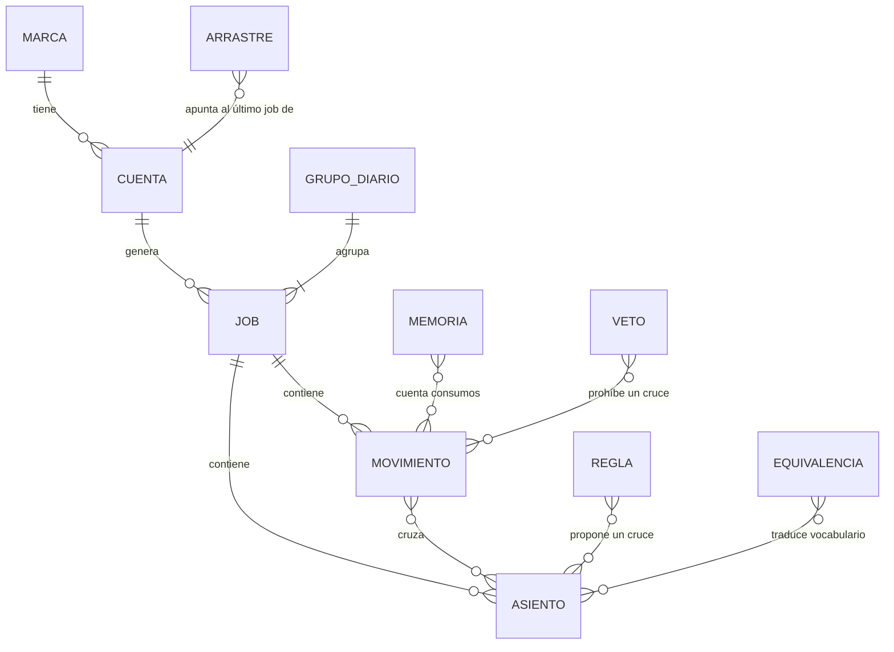

# Modelo de datos del conciliador bancario

Fecha: 2026-09-16 · Fuente: `app.py:78-82,591-805` y los módulos de `engine/`, al commit `8b3c5c1`

El conciliador no tiene base de datos propia: cada "tabla" es un archivo JSON dentro de `datos/`, que se lee y se escribe entero en cada operación. Son trece de nombre fijo, más uno por corrida y uno por tablero diario [`app.py:78-82,1111`; ADR-0007]. Lo único externo es el Postgres del hub, que se lee y nunca se escribe [`engine/cuentas.py:111-114`].

## Diagrama

`MARCA` y `CUENTA` viven en el hub. Todo lo demás vive en archivos.

## Entidades

**Movimiento bancario.** Una línea del extracto. Campos: `id`, `fecha`, `comprobante`, `descripcion`, `detalle`, `debito`, `credito`, `saldo`, `archivo`, `pagina` y `advertencia`; `importe` y `lado` se derivan [`parsers/santander_pdf.py:19-53`]. El débito o el crédito se toman del delta de saldos y no del monto impreso, porque el delta "es infalible"; cuando los dos no coinciden, el parser deja `advertencia` en la fila [`parsers/santander_pdf.py:5-6,170`].

**Asiento del mayor.** Una línea del libro mayor del FBS. Campos: `id`, `hoja` (`E` u `O`), `asiento`, `fecha`, `referencia`, `comentario`, `debe` y `haber`, con `importe` y `lado` derivados [`parsers/mayor_xlsx.py:16-45`]. La hoja distingue la cuenta que debería reflejar el extracto de la operativa con lo pendiente.

**Conciliación (`<job_id>.json`).** El resultado completo de una corrida: los movimientos, los asientos, los cruces con su método, las categorías del resumen, las notas de la conciliación manual y el estado de la IA. Es el archivo más grande y el que se exporta al Excel de salida: doce hojas fijas más una de sugerencias cuando la IA propuso alguna [`app.py:1592,1633-1718`].

**Tablero diario (`grupo_<id>.json`).** Una corrida del modo diario agrupa un job por cuenta bancaria más el estado del grupo: qué archivos entraron, cuáles quedaron sin cuenta asignada, cuáles llegaron sin su contraparte [`app.py:937-1115`].

**Arrastre (`arrastre_diario.json`).** Un mapa de `cuenta_id` a último `job_id`. Es lo que permite que los pendientes de ayer aparezcan hoy. Borrar una corrida rebobina el arrastre a la anterior [`app.py:1186-1222`].

**Memoria (`memoria_conciliados.json`).** Cuántas veces se consumió cada movimiento y cada asiento. Existe porque los archivos que baja el cliente son acumulativos y el mismo movimiento llega varios días seguidos [`48d062c`]. Dos impuestos idénticos el mismo día son reales, así que nunca se suprime por repetición: solo se omite lo que la memoria registró como ya usado [`f4cd03b`; `app.py:1007-1010`].

**Vetos (`cruces_vetados.json`).** Cruces automáticos que una persona anuló. Quedan prohibidos para siempre [`app.py:1499-1527`].

**Reglas aprendidas.** En `reglas_aprendidas.json`. Cruces derivados de una conciliación manual, de tipo `1a1` o `grupo`, guardados solo cuando cada lado tiene un único concepto [`engine/reglas.py:61-80`].

**Equivalencias (`equivalencias.json`).** Pares de términos que el banco y el mayor llaman distinto. El lado del extracto admite varios términos separados por coma. Arranca con un solo par sembrado, haberes contra sueldos [`engine/equivalencias.py:9-28`].

**Gastos.** En `gastos_usuario.json` y `gastos_excepciones.json`. Términos que el usuario declaró como gasto bancario y conceptos que declaró que nunca lo son [`f7a0954`].

**Análisis.** Tres archivos, `analisis_aprendidos.json`, `analisis_cache.json` y `analisis_uso.json`. Veredictos confirmados, caché de respuestas y consumo diario contra el tope [`engine/analisis.py:189-269`].

**Log de IA (`ia_uso_log.json`).** Las últimas dos mil llamadas con tokens y dólares [`engine/ia_log.py:13,30-47`].

**Cuentas (`cuentas_nave.json`).** Copia local del catálogo del hub, más los mapeos contra el FBS que se aprenden acá y no viajan a la base [`engine/cuentas.py:150-167`].

## Convenciones

**Sin claves primarias.** Hay firmas de texto. Un movimiento se identifica por `fecha|descripcion|neto|comprobante` y un asiento por `hoja|asiento|fecha|debe|haber` [`app.py:694-712`]. La consecuencia práctica: si el banco cambia cómo escribe una descripción, la firma cambia y la memoria deja de reconocer el movimiento.

**El identificador de cuenta.** Es `<banco>-<dígitos>-<moneda>`, y el comentario del módulo aclara por qué: "estable entre la semilla y la base", de modo que el mismo identificador funciona con el hub arriba o abajo [`engine/cuentas.py:119,142`].

**El vínculo con el FBS.** Se aprende una vez. El número interno del FBS no coincide con el número de cuenta bancaria, así que la unión se hace por el código de cuenta contable que viene en el nombre de la hoja del reporte. La primera vez lo asigna el usuario y queda colgado del `cuenta_id`; un código pertenece a una sola cuenta [`engine/cuentas.py:9-14,252-266`].

**La marca no alcanza al aprendizaje.** La separación por marca cubre las cuentas y las corridas. Reglas, equivalencias, gastos y vetos son globales al servicio [`engine/reglas.py:21`].

**Sin borrado lógico ni autoría.** Borrar una corrida diaria es `os.remove` [`app.py:1186-1222`]. Ningún registro guarda quién lo hizo: lo único que queda escrito son las notas de la conciliación manual y el log de IA, ninguno con usuario [`app.py:1299,1386`].

## Vocabulario del cliente y nombres en la base

| Cómo lo llama el cliente | Cómo se llama en los archivos | Cómo aparece en la interfaz |
|---|---|---|
| Cuenta E | `hoja: "E"` | Conciliados (E) |
| Cuenta O | `hoja: "O"` | Pendientes de confirmar (O) |
| Extracto | `MovimientoBanco` | Movimientos del banco |
| Mayor | `AsientoMayor` | Asientos del mayor |
| Arrastre | `arrastre_diario.json` | Pendientes de la corrida anterior |
| Nota de débito | `gastos_por_periodo` | Gastos por mes (ND) |
| Contraasiento | contrapartida en la O | Neteo de la cuenta O |
| Haberes | `es_haberes` | Haberes sin contabilizar |
| Marca | `?marca=` | Selector que abre el hub |

## Migraciones

Cero. No hay Alembic, ni SQL, ni versión de esquema: el formato de cada archivo es el que las funciones de carga esperan, y cambiarlo exige leer las trece funciones `_cargar_*`/`_guardar_*` de `app.py:591-805` [`find`].

Agregar un dato nuevo hoy significa: agregarlo al diccionario que se serializa, tolerar su ausencia al leer archivos viejos, y probarlo a mano contra un `datos/` con corridas anteriores. El único camino de migración que existe es entre servicios, no entre versiones: `GET /api/migracion/exportar` baja todos los archivos y su contraparte solo importa sobre un servicio sin conciliaciones previas, salvo que se fuerce [`app.py:449-488`].
